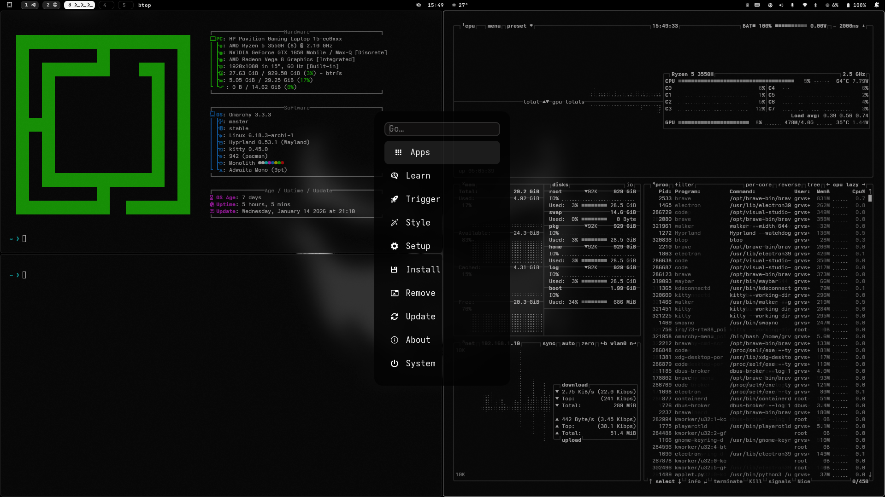
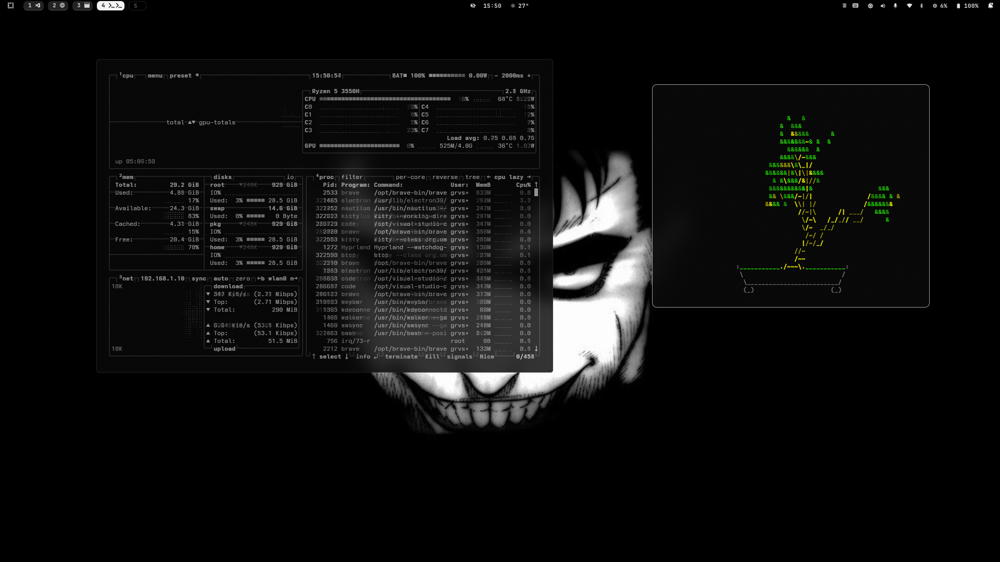
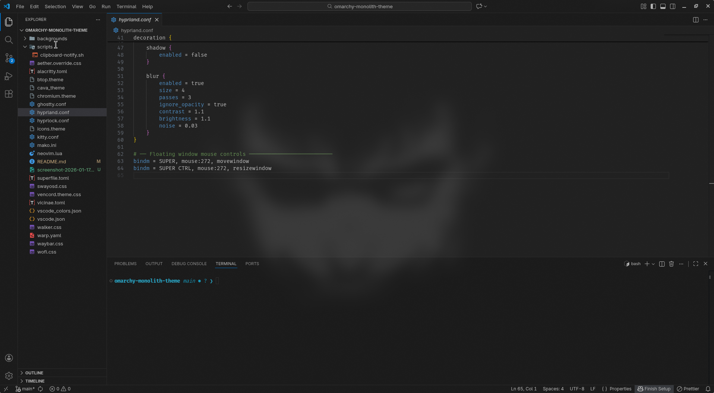

# Monolith

Monolith is a minimal, monochrome Omarchy theme focused on contrast, spacing, and motion rather than color.

It uses a black and white palette with soft gray tones to create a calm, distraction-free environment suitable for daily use.

No semantic colors. No visual noise.

## Installation

### Terminal

```bash
omarchy-theme-install https://github.com/grvsnh/omarchy-monolith-theme
```

### Omarchy Menu

1. Open Omarchy Menu (`Super + Alt + Space`)
2. Go to Install → Style → Theme
3. Paste the repository URL:

```
https://github.com/grvsnh/omarchy-monolith-theme
```

## Themed Components

- Hyprland
- Waybar
- GTK (via Aether override)
- Notifications (mako)
- Launchers (wofi, walker)
- Terminals (kitty, ghostty, alacritty)
- Neovim
- VS Code (UI colors)
- btop
- cava
- Superfile
- Chromium / Brave
- Discord (Vencord)
- Hyprlock

## Features

- Thin borders and tight gaps
- Expressive but controlled animations
- Subtle window blur and opacity
- Floating window mouse controls
- Fully monochrome palette

## Screenshots

### Desktop



### Floating Window



### Editor



## Notes

- This theme does not override user keybindings
- Clipboard behavior is left to user preference
- Designed for maximum compatibility across Hyprland versions

```

```

```

```
